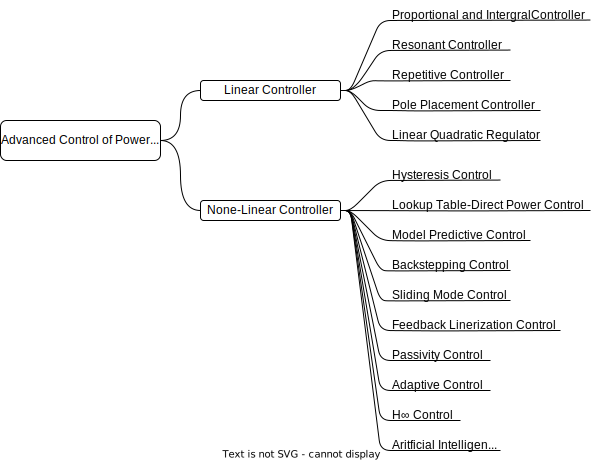
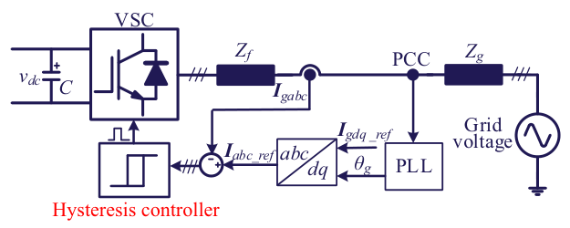
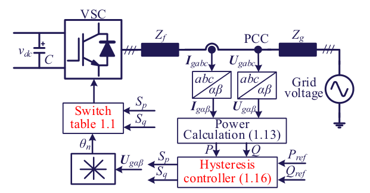
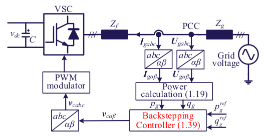
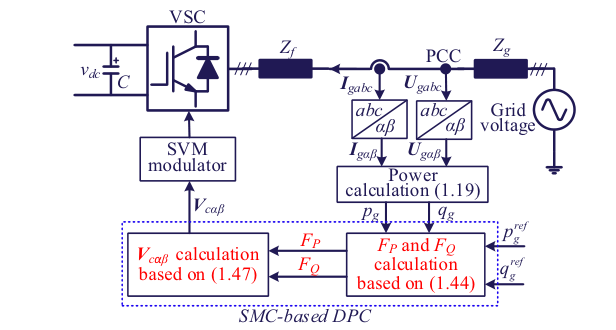
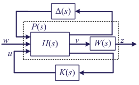
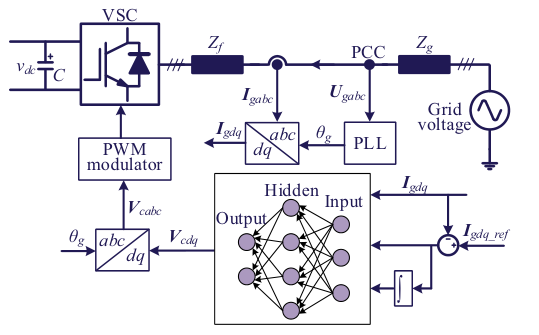

# 1-Overview of Advanced Control of Power Electronic Systems 

## 1.1 Linear controller implementation and analysis

In conclusion, many advanced control methods can be applied in power electronic systems with different objectives, which can be generally divided into two categories: linear controller and nonlinear controller. The overview of these advanced control methods can be seen in Fig. 1.1

*Fig. 1.1 Overview of advanced control methods in power electronic systems.*

###  1.1.1 Implement PI controller

The PI regulator is a linear controller. 
The transfer function of conventional PI controller in the continuous domain can be expressed as:

$$
G_{pi}(s) = k_p + \frac{k_i}{s} \tag{1.1}
$$

where kp and ki are the proportional and integral gains, respectively.

### 1.1.2 Implement PR controller

The transfer function of PR controller can be obtained by shifting the integrator part of the conventional PI controller to both positive and negative fundamental frequency:

$$
G_{PR_ideal}(s) = k_p + \frac{K_i}{s-j\omega} + \frac{k_i}{s+j\omega} = k_p + \frac{2k_is}{s^2 + \omega^2} \tag{1.2}
$$

However, it should be pointed out that the PR controller expression in Eq. (1.2) is an ideal one, which is quite sensitive to the grid frequency variation. Thus, the practical PR controller is adopted by the following equation:

$$
G_{PR}(s) = k_p + \frac{k_r \omega_c s}{s^2 + \omega_c s + \omega_0^2} \tag{1.3}
$$

### 1.1.3 Implement repetitive controller

The conventional repetitive controller (CRC) in the continuous domain can be expressed as follows:

$$
G_{CRC}(s) = k_{RC}\frac{e^{-sT_0}}{1-e^{-sT_0}} \tag{1.4}
$$

where $k_{RC}$ is the gain parameter of CRC regulator, $T_0$ is the period of thefundamental control frequency.

Moreover, based on the nature of exponential function, the conventionalRC given in Eq. (1.4) can also be written as:

$$
G_{CRC}(s) = -\frac{k_{RC}}{2} + \frac{k_{RC}}{T_0s} + \frac{2k_{RC}}{T_0}\sum_{n=1}^{\infty}\frac{s}{s^2 + (n\omega_0)^2} \tag{1.5} 
$$

From the above expression, it can be concluded that an RC is equivalent to a parallel combination of :
(1) a negative proportional term, 
(2) an integral element,
(3) and an infinite number of resonant controllers
connected in parallel at specific harmonic frequencies. 

This implies that an RC contains lots of resonant frequencies, while a PR controller contains only one.

An ideal RC has an infinite open-loop gain at the resonant frequencies and can make the control system to track the reference signals **without steady-state error**. However, it also results in **poor stability inevitably** and has **poor robustness** against the deviation of resonant frequencies. 

To improve the stability and robustness, a low-pass filter $Q(s)$ or a constant $Q$ less than 1 is added to the internal model. When $Q$ is a constant less than 1, the expression of the RC with a certain bandwidth becomes:

$$
G_{BRC}(s) = \frac{K_{RC}Qe^{-T_0s}}{1 - Qe^{-T_0s}} \tag{1.6}
$$

Based on the nature of exponential function, Eq. (1.6) can be rewritten as follows:

$$
\begin{split}
G_{BRC}(s) = -\frac{k_{RC}}{2} + \frac{k_{RC}}{T_0s + T_0\omega_c} + \frac{2k_{RC}}{T_0}\sum_{n=1}^\infty\frac{s + \omega_c}{s^2 + 2\omega_c s + \omega_c^2+(n\omega_0)^2} \\ 
\approx -\frac{k_{RC}}{2} + \frac{k_{RC}}{T_0s + T_0\omega_c} + \frac{2k_{RC}}{T_0}\sum_{n=1}^\infty \frac{s + \omega_c}{s^2 +2\omega_c s + (n\omega_0)^2} 
\end{split}
\tag{1.7}
$$

When $\omega_c$ is far smaller than $\omega_0$, the symbol of approximate equal holds. $\omega_c$ is the resonant bandwidth and $\omega_c = -\ln Q/T_0$.

From Eq. (1.7), it can be seen that the integral element in Eq. (1.5) becomes an inertial element, and the resonant controllers become quasi-resonant controllers.

### 1.1.4 Pole placement control

Based on the system data considered and the operating condition, the state equation of the system under study is given by:

$$
\dot{X} = AX + BU
$$

Where $U$ is input signal, we set the the feedback that the output is set as input: $U = -KX$, The use of state feedback control modifies the system state equation to $\dot{X} = (A - BK)X$, which is the state variable presentation of the compensated system. The characteristic equation of the compensated system is: $|sI -A + BK| = 0$, Here, the state feedback gain matrix K can be determined using the Ackermann’s formula, which is:

$$
K =
\begin{bmatrix}
0 & 0 & 0 & ... & 1
\end{bmatrix}
\begin{bmatrix}
B & AB & ... & A^{n-1}B
\end{bmatrix}
\phi(A)
\tag{1.8}
$$

where $\phi(A) = A^n + \alpha_1 A^{n-1} + ... + \alpha_{n-1} A + \alpha_n I$, $\alpha_i$ are the coefficients of the desired characteristic polynomial.

However, the pole placement control is based on an accurate model of the system. The control performance will be deteriorated if the system parameters are deviated. Furthermore, the pole placement control is only applicable for a linear plant, which might be a limitation for this method, since most power electronic plants are nonlinear.

### 1.1.5 Linear quadratic regulator

LQR is a linear optimal control scheme based on a state space equation. The control object of LQR is a linear system given in the form of state space in modern control theory, and the objective function is a quadratic function of the object state and control input.

Consider the single-input, single-output system with:

$$
\dot{\mathbf{x}} = \mathbf{Ax}(t) + \mathbf{Bu}(t)
$$

and feedback:

$$
u(t) = \mathbf{-Kx}(t) = 
\begin{bmatrix}
k_1 & k_2 &...& k_n
\end{bmatrix}
\mathbf{x}(t)
$$

We can consider the performance index:

$$
J = \int_0^\infty(\mathbf{x}(t)\mathbf{Qx}(t) + Ru^2(t))dt \tag{1.9}
$$

where $R > 0$ is a scalar weighting factor. This index is minimized when

$$
\mathbf{K} = R^{-1} \mathbf{B}^T \mathbf{P}
$$

The $n \times n$ matrix $\mathbf{P}$ is determined from the solution of the equation

$$
\mathbf{A}^T \mathbf{P} + \mathbf{PA} - \mathbf{PB} R^{-1} \mathbf{B}^T\mathbf{P} + \mathbf{Q} = \mathbf{0} \tag{1.10}
$$

where Q is a symmetrical positive semidefinite diagonal matrix, which is the weighing matrix of X. R is a symmetrical positive definite diagonal matrix, which is the weighing matrix of control action U. The weights are selected according to the task to be done in this control method. In this way, the control objectives can be set flexibly in LQR method.

Equation (1.10) is often called the algebraic Riccati equation. This optimal control problem is called the **linear quadratic regulator (LQR)**

## 1.2 Nonlinear controller implementation and analysis

In this context, some advanced nonlinear control methods may be necessary in order to improve the performance of power electronic systems.

### 1.2.1 Hysteresis control

$$
S_{abc} = \left\{
    \begin{aligned}
    -1, \boldsymbol{I}_{gabc} \ge \boldsymbol{I}_{abc\_ref} + h\\
    1, \boldsymbol{I}_{gabc} \le \boldsymbol{I}_{abc\_ref} - h
    \end{aligned}
    \right. \tag{1.11}
$$

where $S_{abc}$ is the switching signal, 1 means upper switch is on, -1 means lower switch is on, and $h$ is the hysteresis band. The actual current is made to follow the reference current by forcing the actual current to stay within the hysteresis band.

*fig 1.2 Hysteresis control scheme applied in a three-phase voltage source converter.*

### 1.2.2 Lookup table-based direct power control

It directly selects the desired voltage vector from a predefined switching table, according to the grid voltage position (or virtual flux position) and the errors between the reference active/reactive power and feedback value.The internal current loop existing in voltage-oriented control is eliminated in DPC. As a result, DPC features very quick dynamic response with simple structure. 

The power calculation block can be expressed as
$$
\left\{
    \begin{aligned}
    &\boldsymbol{P} = \frac{3}{2}(\boldsymbol{U}_{g\alpha\beta}\cdot \boldsymbol{I}_{g\alpha\beta}) = \frac{3}{2} (u_{g\alpha} i_{g\alpha} + u_{g\beta} i_{g\beta})\\
    &\boldsymbol{Q} = \frac{3}{2} (\boldsymbol{U}_{g\alpha\beta} \times \boldsymbol{I}_{g\alpha\beta}) = \frac{3}{2}(u_{g\beta}i_{g\alpha} - u_{g\alpha}i_{g\beta})
    \end{aligned} \tag{1.12}
\right. 
$$

where $\boldsymbol{U}_{g\alpha\beta} =u_{g\alpha} + ju_{g\beta}$, and $\boldsymbol{I}_{g\alpha\beta} = i_{g\alpha} +ji_{g\beta}$.

In order to obtain the position of grid voltage vector, the angle of grid voltage can be calculated based on $u_{g\alpha}$ and $u_{g\beta}$ as:

$$
\theta = \arctan(u_{g\beta}/u_{g\alpha})
$$

The switch table is based on the position of grid voltage vector. In order to optimize the performance of converter, the grid voltage can be divided into 12 sectors. The angle of 12 sectors can be expressed as

$$
(n - 2) \frac{\pi}{6} \leq \theta_n \leq (n - 1) \frac{\pi}{6}, n = 1,2,...,12
$$

The power hysteresis controller consists of active power and reactive power hysteresis controller. The inputs are the power error between the power reference and the real power. The output reflects the status of power deviation, which can be expressed as $S_p$ and $S_q$. $S_p$ and $S_q$ only have two status, which can be expressed as:

$$
S_p = 
\left\{
    \begin{aligned}
    0, P < P_{ref} - H_p\\
    1, P > P_{ref} + H_p
    \end{aligned}
\right.\\
S_q = 
\left\{
    \begin{aligned}
    0, Q < Q_{ref} - H_q\\
    1, Q > Q_{ref} + H_q
    \end{aligned}
\right. \tag{1.13}
$$

where $H_p$ and $H_q$ are the hysteresis band.

*fig1.3 Control diagram of lookup tableebased direct power control applied in a three-phase voltage source converter*

*tab 1.1 Switch table applied in lookup tableebased direct power control.*
|$S_p$|$S_q$|$\theta_1$|$\theta_2$|$\theta_3$|$\theta_4$|$\theta_5$|$\theta_6$|$\theta_7$|$\theta_8$|$\theta_9$|$\theta_{10}$|$\theta_{11}$|$\theta_{12}$|
|--|--|--|--|--|--|--|--|--|--|--|--|--|--|
|**1**|**0**|101|111|100|000|110|111|010|000|011|111|001|000|
|**1**|**1**|111|111|000|000|111|111|000|000|111|111|000|000|
|**0**|**0**|101|100|100|110|110|010|010|011|011|001|001|101|
|**0**|**1**|100|110|110|010|010|011|011|001|001|101|101|100|

Although LUT-DPC has been considered as a powerful and robust control scheme for PWM rectifier, high-power ripples and variable switching frequency are two of the most notable drawbacks of conventional LUT-DPC. Furthermore, the required sampling frequency is usually very high in order to achieve relative satisfactory performance, which increases the hardware burden and might limit the application of this method.

### 1.2.3 Model predictive control

As a more advanced control theory, MPC has received extensive attention inthe field of power electronic systems in recent years. In MPC, a cost functionshould first be defined according to an expected control target, and thencalculate and compare the cost function when different voltage vectors areapplied in each control cycle. Then, the optimal voltage vector is selected forthe system control in a specific sample period.

Compared with the traditional lookup table method, this vector selection
method based on the cost function is more accurate in selecting the voltage
vector due to the great flexibility in the selection of the cost function. 

### 1.2.4 Backstepping control

For the whole design procedures of the nonlinear BS controller, there are two steps in order to force the system states to track the desired reference commands. 

The first step is to design the DC-bus voltage BS controller to control the $V_{dc}$, and the output is regarded as the reference value of active power $p_g^{ref}$

The second step is to design the power BS controller to control the active and reactive powers according to $p_g^{ref}$ and $q_g^{ref}$ (which is always set to zero for unity power factor control). 

*fig 1.4 Control scheme of backstepping control applied in a three-phase voltage source
converter*

### 1.2.5 Sliding mode control

As a nonlinear control strategy, the SMC strategy has excellent dynamic performance and good parameter robustness and has been widely studied in the field of power electronic systems.

The main idea of the sliding mode variable structure control strategy is to design the sliding mode surface and the approaching law according to the desired dynamic characteristics of the system, so that the system state moves from outside the sliding mode surface to the sliding mode surface, which is achieved by discontinuous control. 

### 1.2.6 Feedback linearization

FBL is a common nonlinear control approach, whose main idea is to transform a nonlinear system into a fully or partially decoupled linear one by means of state feedback and nonlinear transformation, so that linear control strategies can be used. 

### 1.2.7 Passivity control

The passivity-based control of VSCs recently emerges as a promising way to tackle the instability challenge and achieve robustness. The concept of passivity in the frequency domain implies that the real part of the output impedance/admittance of VSC is nonnegative.

It should be noted that the passivity control of VSC is a sufficient condition
but not a necessary condition for the stable operation under weak grid. 

### 1.2.8 Adaptive control

Most of the aforementioned control methods are based on the model parameters without considering the parameters uncertainty and deviation due to different operation points. Large parameter deviations can be detrimental for the system performance like steady-state error or oscillating dynamic process.

### 1.2.9 $H_\infty$ control

The  $H_\infty$ control has been introduced in the early 1980s and opened a new direction in robust control design. Recently, this approach has been applied to the control of active power filters.

The design of loop-shaping controller based on $H_\infty$ control method is displayed in fig. 1.6, in which P(s) is the augmented plant obtained by appending the weighting function to the output of the transfer function of the desired loop shapes, $w$ is in the original input, $u$ is the additional input to enhance the system performance, $v$ is the output, $H(s)$ is the plant, $D(s)$ represents the system uncertainty, and $W(s)$ is the system weighting function. The design goal is to synthesize the stabilizing controller $K(s)$ so that the $H_\infty$ gain from $w$ to $z$ is less than 1

*fig 1.6 Control configuration for generalized HN control*

### 1.2.10 Artificial intelligence

The AI contains many smart algorithms, one of them mostly used is the neural network (NN). The main advantages of NN are parallel processing, learning ability, robustness, and generalization.

*fig 1.7 Control diagram of neural network applied in a three-phase voltage source
converter for current control*