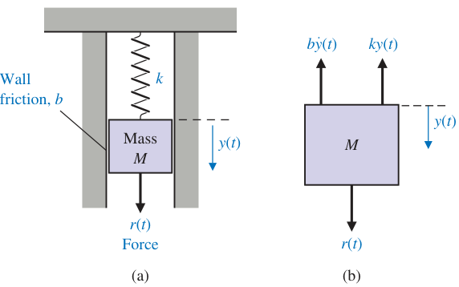
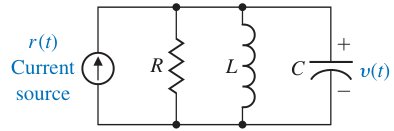

# chapter 2. Mathematical Models of Systems

## 2.1 Differential equations of physical systems

**Through and Across Variables**

*Across* — Variables that are defined by measuring a difference, or drop, across an element. Examples of such variables are voltage (for an electrical domain) or pressure (for a fluid domain). You measure them with a sensor connected in parallel to the element.

*Through* — Variables that are considered as being transmitted through an element unchanged. Examples of such variables are current (for an electrical domain) or flow rate (for a fluid domain). You measure them with a sensor connected in series with the element.

## 2.2 Differential equations of physical systems

{ width="400" }

*fig 2.1*
*(a) Spring-mass-damper system.*
*(b) Free-body diagram.*

Summing the forces acting on $M$ and utilizing Newton’s second law yields

$$
M\frac{d^{2}y(t)}{dt^{2}} + b\frac{dy(t)}{dt} + ky(t) = r(t) \tag{2.1}
$$

$k$ is the spring constant of the ideal spring
$b$ is the friction constant.
$M$ is the mass of the brick
$y$ is the position of the brick (input)
$r$ is the resaltant force on the brick (output)

{ width="250"}

*fig 2.2 RLC circuit*

One may describe the electrical RLC circuit of fig 2.2 by utilizing Kirchhoff’s current law. Then we obtain the following integrodifferential equation:

$$
\frac{v(t)}{R} + C\frac{dv(t)}{dt} + L\int_0^t{v(t)dt} = r(t) \tag{2.2}
$$

To reveal further the close similarity between the differential equations for the mechanical and electrical systems, we shall rewrite Equation (2.1) in terms of velocity:

$$
v(t) = \frac{dy(t)}{dt}
$$

Then we have:

$$
M\frac{dv(t)}{dt} + bv(t) + k\int_0^t v(t)dt = r(t) \tag{2.3}
$$

One immediately notes the equivalence of Equations (2.3) and (2.2) where velocity $υ(t)$ and voltage $υ(t)$ are **equivalent variables**, usually called analogous variables, and the systems are **analogous systems**. 

## 2.3 Linear approximations of physical systems

