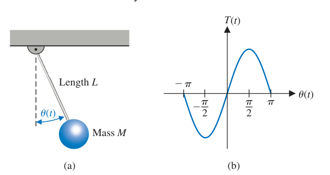

# chapter 2. Mathematical Models of Systems

## 2.1 Differential equations of physical systems

**Through and Across Variables**

*Across* — Variables that are defined by measuring a difference, or drop, across an element. Examples of such variables are voltage (for an electrical domain) or pressure (for a fluid domain). You measure them with a sensor connected in parallel to the element.

*Through* — Variables that are considered as being transmitted through an element unchanged. Examples of such variables are current (for an electrical domain) or flow rate (for a fluid domain). You measure them with a sensor connected in series with the element.

{ width="400" }

*fig 2.1*
*(a) Spring-mass-damper system.*
*(b) Free-body diagram.*

Summing the forces acting on $M$ and utilizing Newton’s second law yields

$$
M\frac{d^{2}y(t)}{dt^{2}} + b\frac{dy(t)}{dt} + ky(t) = r(t) \tag{2.1}
$$

$k$ is the spring constant of the ideal spring
$b$ is the friction constant.
$M$ is the mass of the brick
$y$ is the position of the brick (input)
$r$ is the resaltant force on the brick (output)

{ width="250"}

*fig 2.2 RLC circuit*

One may describe the electrical RLC circuit of fig 2.2 by utilizing Kirchhoff’s current law. Then we obtain the following integrodifferential equation:

$$
\frac{v(t)}{R} + C\frac{dv(t)}{dt} + L\int_0^t{v(t)dt} = r(t) \tag{2.2}
$$

To reveal further the close similarity between the differential equations for the mechanical and electrical systems, we shall rewrite Equation (2.1) in terms of velocity:

$$
v(t) = \frac{dy(t)}{dt}
$$

Then we have:

$$
M\frac{dv(t)}{dt} + bv(t) + k\int_0^t v(t)dt = r(t) \tag{2.3}
$$

One immediately notes the equivalence of Equations (2.3) and (2.2) where velocity $υ(t)$ and voltage $υ(t)$ are **equivalent variables**, usually called analogous variables, and the systems are **analogous systems**. 

## 2.2 Linear approximations of physical systems

*A linear system satisfies the properties of superposition and homogeneity.*

**superposition:**

$$
\left.
\begin{aligned}
& x_1(t) \rightarrow y_1(t) \\
& x_2(t) \rightarrow y_2(t)
\end{aligned}
\right\}
\Rightarrow
\left.
\begin{aligned}
& (x_1(t) + x_2(t)) \rightarrow  (y_1(t) + y_2(t))
\end{aligned}
\right.
\tag{2.4}
$$

**homogeneity:**

$$
x(t) \rightarrow y(t) \Rightarrow \beta x(t) \rightarrow \beta y(t) \tag{2.5}
$$

A system characterized by the relation $y(t)
=x^2(t)$ is not linear, because the superposition property is not satisfied. 

A system represented by the relation $y(t)=mx(t)+b$ is not linear, because it does not satisfy thehomogeneity property. 

However, this second system may be considered linear about an operating point $x_0$, $y_0$ for small changes $∆x$ and $∆y$. When $x(t) =x_0 + ∆x$ and $y(t) = y_0 + ∆y$, we have:

$$
y(t) = mx(t) + b
$$

Then:

$$
y_0 + ∆y(t) = mx_0 + m∆x(t) + b
$$

Therefore, $∆y(t) = m∆x(t)$, which satisfies the necessary conditions.

We can often linearize nonlinear elements assuming **small-signal** conditions. This is the normal approach used to obtain a linear equivalent circuit for electronic circuits and transistors. 

Because the curve (function) is continuous over the range of interest, a **Taylor series** expansion about the operating point may be utilized.

Assume that the nonlinear system:

$$
y(t) = g(x(t)) \tag{2.6}
$$

Then we have:

$$
\begin{split}
y(t) = g(x(t)) = g(x_0) + \left.\frac{dg}{dx}\right|_{x(t) = x_0}\frac{x(t)-x_0}{1!} \\+ \left.\frac{d^2g}{dx^2}\right|_{x(t) = x_0} \frac{(x(t)-x_0)^2}{2!}+...
\end{split}
\tag{2.7}
$$ 

The slope at the operating point:

$$
m = \left.\frac{dg}{dx}\right|_{x(t) = x_0}
$$

is a good approximation to the curve over a small range of $x(t) - x_0$, the deviation from the operating point. Then, as a reasonable approximation, Equation (2.7) becomes:

$$
y(t) = g(x_0) + \left.\frac{dg}{dx}\right|_{x(t) = x_0}(x(t) - x_0) = y_0 + m(x(t) - x_0) \tag{2.8}
$$

Finally, Equation (2.8) can be rewritten as the linear equation:

$$
y(t) -y_0 = m(x(t) - x_0)
$$

or

$$
\Delta y(t) = m \Delta x(t)  \tag{2.9}
$$

*fig 2.3 Pendulum oscillator*

Consider the pendulum oscillator shown in Figure 2.6(a). The torque on the mass is:

$$
T(t) = MgLsin\theta(t)
$$

The nonlinear relation between $T(t)$ and $\theta(t)$ is shown graphically in Figure 2.6(b).The first derivative evaluated at equilibrium provides the linear approximation, which is:

$$
T(t) -T_0 \cong \left.MgL \frac{\partial sin\theta}{\partial \theta} \right|_{\theta (t) = \theta_0} (\theta(t) -\theta_0)
$$

where $T_0 = 0$, then we have:

$$
T(t) = MgL\theta (t) \tag{2.10}
$$

## 2.3 The Laplace Transform

The Laplace transform method substitutes relatively easily solved algebraic equations for the more difficult differential equations. The time-response solution is obtained by the following operations:

1. Obtain the linearized differential equations.
2. Obtain the Laplace transformation of the differential equations.
3. Solve the resulting algebraic equation for the transform of the variable of interest.

The Laplace transformation for a function of time, $f(t)$, is:

$$
F(s) = \int_{0^-}^{\infty}f(t)e^{-st}dt = \mathscr{L}\{f(t)\} \tag{2.11}
$$

The **inverse Laplace transform** is written as:

$$
f(t) = \frac{1}{2\pi j} \int_{\sigma-j\infty}^{\sigma + j\infty} F(s) e^{+st}ds \tag{2.12}
$$

*table 2.1 Important Laplace Transform Pairs*

|$f(t)$                 |$F(s)$|
|-----------------------|-------------------|
|Step function $u(t)$   |$\Large \frac{1}{s}$|
|$e^{-at}$              |$\Large \frac{1}{s+a}$|
|$sin\omega t$          |$\Large \frac{\omega}{s^2 + \omega^2}$|
|$cos\omega t$          |$\Large \frac{s}{s^2 + \omega^2}$|
|$t^n$                  |$\Large \frac{n!}{s^{n+1}}$|
|$\Large f^{(kt)} = \frac{d^kf(t)}{dt^k}$ |$s^kF(s) - s^{k-1}f(0^-) - s^{k-2}f'(0^-) - s^{k-3}f''(0^-) - ... - f^{(k-1)}(0^-)$|
|$\Large \int_{-\infty}^tdt$   |$\Large \frac{f(s)}{s} + \frac{1}{s} \int_{-\infty} ^0 f(t)dt$|
|Impulse fnction $\delta(t)$ | 1 |
|$e^{-at}sin \omega t$  |$\Large \frac{\omega}{(s+a)^2 +\omega^2}$|
|$e^{(-at)}cps \omega t$  |$\Large \frac{s+a}{(s+a)^2 + \omega^2}$ |
|$\frac{1}{\omega}[{(\alpha - a)^2 + \omega^2}]^{1/2}e^{-at}sin(\omega t + \phi), \phi = tan^{-1}\frac{\omega}{\alpha - a}$|$\Large \frac{s + \alpha}{(s+\alpha)^2 + \omega^2}$|
|$\frac{\omega_n}{\sqrt{1 - \zeta}}e^{-\zeta\omega_n t}sin\omega_n\sqrt{1 - \zeta^2}t$ | $\Large \frac{\omega_n^2}{s^2 + 2\zeta\omega_n + \omega_n^2}$ |

Alternatively, the Laplace variable s can be considered to be the differential operator so that:

$$
s = \frac{d}{dt} \tag{2.13}
$$

Then we also have the integral operator:

$$
\frac{1}{s} = \int_{0^-}^{t}dt
$$

## 2.4 The Transfer Function of Linear Systems

Let us consider the long-term behavior of a system and determine the response to certain inputs that remain after the transients fade away. Consider the dynamic system represented by the differential equation:

$$
\begin{split}
\frac{d^ny(t)}{dt^n} + q_{n-1}\frac{d^{n-1}y(t)}{dt^{n-1}} + ...+q_0y(t) \\
=p_{n-1}\frac{d^{n-1}r(t)}{dt^{n-1}} + p_{n-2}\frac{d^{n-2}}{dt^{n-2}} + ... +p_0r(t)
\end{split}
\tag{2.14}
$$

where $y(t)$ is the response, and $r(t)$ is the input or forcing function. If the initial conditions are all zero, then the transfer function is the coefficient of $R(s)$ in:

$$
Y(s) = G(s)R(s) = \frac{p_{n-1}s^{n-1} + p_{n-2}s^{n-2} + ... + p_0}{s^n + q_{n-1}s^{n-1} + ... + q_0} R(s) \tag{2.15}
$$

